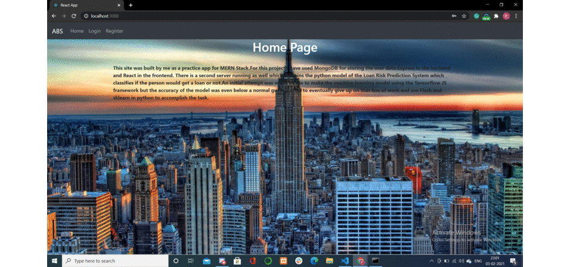

# ABS

Albus Banking System
This app was built by me as a practice app for MERN Stack.

For this project I have used MongoDB for storing the user data.Express in the backend and React in the frontend.
There is a second server running as well which contains the python model of the Loan Risk Prediction System which classifies if the person would get a loan or not.

An initial attempt was made by me to make the machine learning model using the Tensorflow JS framework but the accuracy of the model was even below a normal guess.
So had to eventually give up on that line of work and use Flask and sklearn in python to accomplish the task.
Here is animated GIF of the app:



## Tech Stack

- ### Frontend

        React
        Bootstrap
        Sass
        CSS

- ### Backend

        Express JS
        Flask

- ### Database

        MongoDB

- ### Server/Runtime

        Node JS

## How to run locally

- Install Node and MongoDB(if not using cloud platform) on your system.
- Clone the repository on your system.
- Move into the server folder and Run the command in the terminal

```js

npm install
nodemon app.js

```

- Then open another terminal and run the commands after entering the directory client

```js

npm install
npm start

```

- Then open another terminal and run the following commands in flask directory

```

pip install requirements.txt
python app.py

```

- Visit "http://localhost:3000" on your browser
- Now you are all set to start!

## Database Models Used

There are two models defined for storing data

1.User model

```
username :{
        type : String,
        required : true,
        min : 6,
        max : 15
    },
    password : {
        type : String,
        required : true
    },
    role : {
        type : String,
        enum : ['user','admin'],
        required: true
    },
```

2.Bank Form Details Model

```
gender : {
        type : Number,
        default:0,
        required : true
    },
    marital : {
        type : Number,
        default:0,
        required : true
    },
    dependents : {
        type : Number,
        default:0,
        required : true
    },
    education : {
        type : Number,
        default:0,
        required : true
    },
    status : {
        type : Number,
        default:0,
        required : true
    },
    appincome : {
        type : Number,
        default:0,
        required : true
    },
    coapincome : {
        type : Number,
        default:0,
        required : true
    },
    loan : {
        type : Number,
        default:0,
        required : true
    },
    loanterm : {
        type : Number,
        default:0,
        required : true
    },
    credit : {
        type : Number,
        default:0,
        required : true
    },
    property : {
        type : Number,
        default:0,
        required : true
    },
    predict:{
        type:Number,
        default:0,
        required: true
    }
```
## Machine Learning Model

For the machine learning part several models were tried including Decision Tree,SVM and K-Means.The best result came through Logistic Regression.The data used here is taken from kaggle and comprises of only two categories with the distribution as 65% and 35% which makes the minimum accuracy to be 65% for a model to be considered for evaluation.
The data composed of deatils such as:

```
['Gender','Married','Dependents','Education','Self_Employed','Credit_History','Property_Area','Loan_Status']
```

Sklearn package was used for machine learning.
Data cleaning was done prior to fitting the data to the model.

| Model       | Accuracy    | Time              |
| ------------- |:-------------:|:---------------:|
|Logisitic Regression|80.803%|0.7364733219146729 s |
|GNB| 79.803%|0.015659332275390625 s|  
|Random Forest| 74.384%|0.06247997283935547 s  |
| Decision Tree|75.369%|0.015588045120239258 s|
|SVC|65.517%|47.450788736343384 s|
|KNN| 60.099%|0.1722092628479004 s|
|MLP| 53.695%|0.48421430587768555 s|
|AdaBoost|79.310%|0.1476762294769287 s|

## Workflow

So the app workflow is as follows:
First the user needs to register himself(either as an admin or a regular user) and then using those credentials he needs to log in which would lead him to the main page which contains the form details for the loan. Now after filling the details he would be informed whether his credentials land him a loan or not.
If the user is an admin then he has an additional capability to view all the form details filled uptill now.

## Directory Structre

```
|-- README.md
|-- client
|   |-- node_modules
|   |-- README.md
|   |-- package-lock.json
|   |-- package.json
|   |-- public
|   |   |-- background.jpg
|   |   |-- favicon.ico
|   |   |-- index.html
|   |   |-- logo192.png
|   |   |-- logo512.png
|   |   |-- manifest.json
|   |   `-- robots.txt
|   |-- src
|   |   |-- App.js
|   |   |-- Components
|   |   |   |-- Admin.js
|   |   |   |-- Home.js
|   |   |   |-- Loans.js
|   |   |   |-- Login.js
|   |   |   |-- Message.js
|   |   |   |-- Navbar.js
|   |   |   |-- Register.js
|   |   |   `-- Unauthorized.js
|   |   |-- Context
|   |   |   `-- AuthContext.js
|   |   |-- Services
|   |   |   |-- AuthService.js
|   |   |   `-- LoanService.js
|   |   |-- hocs
|   |   |   |-- PrivateRoute.js
|   |   |   `-- UnPrivateRoute.js
|   |   |-- index.js
|   |   |-- react-app-env.d.ts
|   |   `-- unauthorized.scss
|   `-- tsconfig.json
|-- flask
|   |-- __pycache__
|   |   `-- app.cpython-38.pyc
|   |-- app.py
|   |-- classifier.py
|   |-- data.csv
|   |-- model
|   |   |-- AdaBoost.pkl
|   |   |-- Decision_Tree_Classifier.pkl
|   |   |-- Gaussian_Naive_Bayes.pkl
|   |   |-- KNN.pkl
|   |   |-- Logistic_Regression.pkl
|   |   |-- Multi_Layer_Perceptron.pkl
|   |   |-- Random_Forest.pkl
|   |   `-- SVC_Linear.pkl
|   |-- requirements.txt
|   `-- templates
|       `-- index.html
|-- gif.gif
`-- server
    |-- node_modules
    |-- app.js
    |-- models
    |   |-- Loan.js
    |   `-- User.js
    |-- package-lock.json
    |-- package.json
    |-- passport.js
    `-- routes
        `-- User.js
```